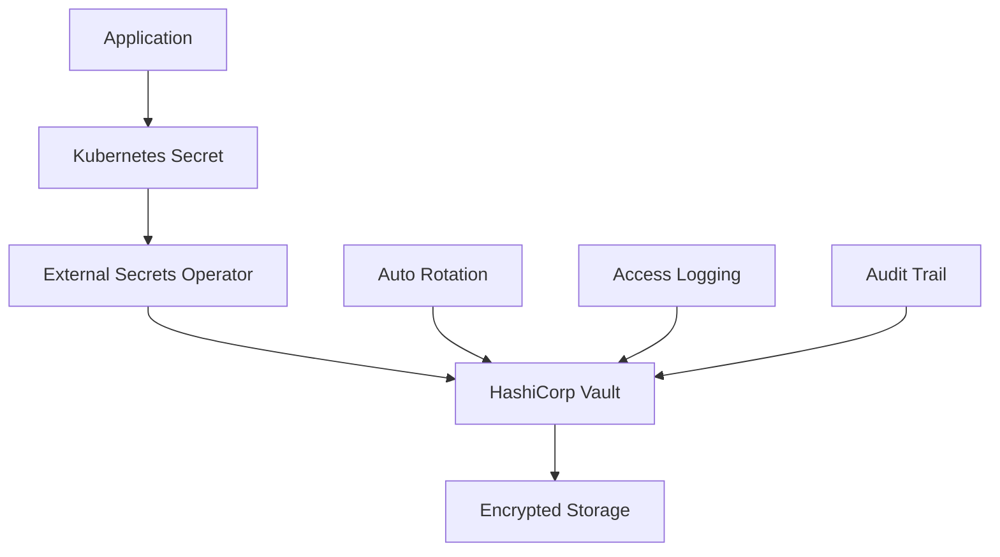

# Security Guide

## Overview

This guide covers security best practices for your **${{ values.databaseName }}** MySQL database instance, including access control, encryption, and monitoring.

## Access Control

### User Management

Your database uses a dedicated service account with minimal required privileges:

| Setting            | Value                         |
| ------------------ | ----------------------------- |
| **Username**       | `${{ values.username }}`      |
| **Authentication** | MySQL Native Password         |
| **Host Access**    | Kubernetes cluster only (`%`) |
| **SSL/TLS**        | Required                      |

### Privilege Configuration

Current user privileges:


=== "{{ privilege }}"

**Read Access**: Query data from tables, views, and stored procedures

    **Security Implications**:
    - Can read all data in granted tables
    - Cannot modify or delete data
    - Safe for read-only applications and reporting

    **Best Practice**: Use for dashboards and analytics applications
    
    **Insert Access**: Add new records to tables

    **Security Implications**:
    - Can add new data to tables
    - Cannot modify existing data
    - Risk of data volume growth

    **Best Practice**: Validate input data, implement rate limiting
    
    **Update Access**: Modify existing records

    **Security Implications**:
    - Can change existing data
    - Risk of data corruption if misused
    - Cannot add or remove records

    **Best Practice**: Use with WHERE clauses, audit changes
    
    **Delete Access**: Remove records from tables

    **Security Implications**:
    - Can permanently remove data
    - High risk if used incorrectly
    - Cannot recover deleted data without backup

    **Best Practice**: Implement soft deletes, require confirmation
    
    **Create Access**: Create new tables, indexes, and views

    **Security Implications**:
    - Can create new database objects
    - Potential for resource exhaustion
    - Risk of schema changes

    **Best Practice**: Monitor object creation, implement approval process
    
    **Drop Access**: Remove tables, indexes, and views

    **Security Implications**:
    - Can permanently remove database objects
    - Extreme risk - can cause data loss
    - Cannot recover without backup

    **Best Practice**: Restrict to admin users only, require confirmation
    
    **Alter Access**: Modify table structure and properties

    **Security Implications**:
    - Can change table schema
    - Risk of breaking applications
    - Can impact performance

    **Best Practice**: Test in staging, coordinate with applications
    
    **Index Access**: Create and remove indexes

    **Security Implications**:
    - Can impact query performance
    - Can consume storage space
    - Minimal security risk

    **Best Practice**: Monitor index usage and storage impact
    
    **{{ privilege }}**: Administrative privilege for {{ privilege.lower() }} operations

    **Security Implications**: Administrative access - use with caution
    



### Principle of Least Privilege

!!! warning "Security Principle"
This user has been granted only the minimum privileges required for the application to function. Do not grant additional privileges without security review.

## Encryption

### Data in Transit

All connections use TLS encryption:

| Setting                    | Configuration       |
| -------------------------- | ------------------- |
| **TLS Version**            | 1.2 or higher       |
| **Cipher Suites**          | Strong ciphers only |
| **Certificate Validation** | Required            |
| **Protocol**               | MySQL over TLS      |

#### Verifying TLS Connection

```sql
-- Check current connection encryption
SHOW STATUS LIKE 'Ssl_cipher';
SHOW STATUS LIKE 'Ssl_version';

-- View TLS session information
SELECT
    CONNECTION_ID(),
    USER(),
    HOST(),
    COMMAND,
    STATE,
    CONNECTION_TYPE
FROM information_schema.PROCESSLIST
WHERE ID = CONNECTION_ID();
```

### Data at Rest

Database files are encrypted using:

- **Kubernetes**: Encrypted persistent volumes
- **Storage Class**: Uses encrypted storage backend
- **Key Management**: Platform-managed encryption keys

### Password Security

Passwords are managed through multiple secure layers:



#### Password Requirements

- **Length**: Minimum 32 characters
- **Complexity**: Mixed alphanumeric with symbols
- **Rotation**: Automatic every 90 days
- **History**: Previous 12 passwords cannot be reused

## Network Security

### Network Isolation

The database is protected by multiple network security layers:

```yaml
# Example NetworkPolicy
apiVersion: networking.k8s.io/v1
kind: NetworkPolicy
metadata:
  name: ${{ values.appName }}-mysql-netpol
  namespace: ${{ values.namespace }}
spec:
  podSelector:
    matchLabels:
      app: mysql
  policyTypes:
    - Ingress
  ingress:
    - from:
        - namespaceSelector:
            matchLabels:
              name: ${{ values.namespace }}
        - podSelector:
            matchLabels:
              app: ${{ values.appName }}
      ports:
        - protocol: TCP
          port: 3306
```

### Access Restrictions

| Access Type    | Allowed From          | Protocol | Port |
| -------------- | --------------------- | -------- | ---- |
| **Database**   | Application pods only | TCP/TLS  | 3306 |
| **Monitoring** | Prometheus            | TCP      | 9104 |
| **Management** | Operator pods         | TCP/TLS  | 3306 |

### Firewall Rules

- **Ingress**: Only from authorized pods in the same namespace
- **Egress**: Restricted to necessary external services (Vault, monitoring)
- **External Access**: Blocked by default

## Authentication Security

### Multi-Factor Authentication

Access to database management tools requires MFA:

1. **Vault Access**: GitHub SSO + MFA
2. **Kubernetes**: RBAC with MFA-enabled accounts
3. **Monitoring**: Grafana with SSO + MFA
4. **Admin Tools**: phpMyAdmin with SSO + MFA

### Service Account Security

```yaml
# Secure service account configuration
apiVersion: v1
kind: ServiceAccount
metadata:
  name: ${{ values.appName }}-db-access
  namespace: ${{ values.namespace }}
  annotations:
    vault.io/role: ${{ values.appName }}-db-reader
    vault.io/secret-path: secret/data/${{ values.appName }}
automountServiceAccountToken: true
---
apiVersion: rbac.authorization.k8s.io/v1
kind: Role
metadata:
  name: ${{ values.appName }}-secret-reader
  namespace: ${{ values.namespace }}
rules:
  - apiGroups: ['']
    resources: ['secrets']
    resourceNames: ['${{ values.appName }}-secret']
    verbs: ['get', 'list']
  - apiGroups: ['']
    resources: ['configmaps']
    resourceNames: ['${{ values.appName }}-config']
    verbs: ['get', 'list']
```

## Auditing and Monitoring

### Database Audit Logging

MySQL audit logging is enabled to track:

- **Connection attempts** (successful and failed)
- **Query execution** (DDL and DML statements)
- **Privilege changes**
- **Administrative operations**

#### Audit Log Configuration

```sql
-- Check audit logging status
SHOW VARIABLES LIKE 'audit_log%';

-- View recent audit events
SELECT
    TIMESTAMP,
    CONNECTION_ID,
    ACCOUNT,
    COMMAND_CLASS,
    COMMAND,
    SQL_COMMAND
FROM mysql.audit_log
WHERE TIMESTAMP >= DATE_SUB(NOW(), INTERVAL 1 HOUR)
ORDER BY TIMESTAMP DESC
LIMIT 20;
```

### Security Monitoring

Continuous monitoring for security events:

#### Failed Login Attempts

```sql
-- Monitor failed authentication attempts
SELECT
    DATE(timestamp) as date,
    COUNT(*) as failed_attempts,
    account,
    ip
FROM mysql.audit_log
WHERE command_class = 'connection'
    AND return_code != 0
    AND timestamp >= DATE_SUB(NOW(), INTERVAL 7 DAY)
GROUP BY DATE(timestamp), account, ip
ORDER BY failed_attempts DESC;
```

#### Unusual Query Patterns

```sql
-- Detect unusual query patterns
SELECT
    DIGEST_TEXT,
    COUNT_STAR as execution_count,
    FIRST_SEEN,
    LAST_SEEN
FROM performance_schema.events_statements_summary_by_digest
WHERE LAST_SEEN >= DATE_SUB(NOW(), INTERVAL 1 HOUR)
    AND (
        DIGEST_TEXT LIKE '%DROP%'
        OR DIGEST_TEXT LIKE '%DELETE%'
        OR DIGEST_TEXT LIKE '%TRUNCATE%'
        OR DIGEST_TEXT LIKE '%ALTER%'
    )
ORDER BY LAST_SEEN DESC;
```

### Security Alerts

The following security alerts are configured:

| Alert                    | Condition                          | Severity | Response               |
| ------------------------ | ---------------------------------- | -------- | ---------------------- |
| **Failed Logins**        | >10 failures in 5 minutes          | High     | Auto-lock account      |
| **Privilege Escalation** | GRANT/REVOKE statements            | Critical | Immediate notification |
| **Mass Data Access**     | >10k rows in single query          | Medium   | Review access pattern  |
| **Off-hours Access**     | Connections outside business hours | Low      | Log for review         |
| **Geographic Anomaly**   | Access from new locations          | Medium   | Verify user identity   |

## Compliance and Governance

### Data Classification

Your database may contain sensitive data. Ensure compliance with:

- **GDPR**: EU personal data protection
- **SOX**: Financial data integrity
- **HIPAA**: Healthcare information (if applicable)
- **PCI DSS**: Payment card data (if applicable)

### Data Retention

| Data Type            | Retention Period                     | Disposal Method   |
| -------------------- | ------------------------------------ | ----------------- |
| **Application Data** | As per business requirements         | Secure deletion   |
| **Audit Logs**       | 7 years                              | Encrypted archive |
| **Backup Data**      | 30 days (full), 7 days (incremental) | Secure deletion   |
| **Performance Logs** | 90 days                              | Automatic cleanup |

### Privacy Controls

```sql
-- Example: Pseudonymization for PII
CREATE VIEW users_anonymized AS
SELECT
    id,
    SHA2(CONCAT(email, 'salt'), 256) as email_hash,
    created_at,
    last_login,
    -- Exclude direct PII fields
    'REDACTED' as email,
    'REDACTED' as phone
FROM users;
```

## Security Best Practices

### Application Security

1. **Input Validation**

   ```python
   # Example: Parameterized queries
   cursor.execute(
       "SELECT * FROM users WHERE email = %s AND active = %s",
       (email, True)
   )
   ```

2. **Error Handling**

   ```python
   # Don't expose database errors to users
   try:
       result = db.execute(query)
   except DatabaseError as e:
       logger.error(f"Database error: {e}")
       return {"error": "Internal server error"}
   ```

3. **Connection Security**
   ```python
   # Always use SSL and validate certificates
   connection = mysql.connector.connect(
       host='mysql.namespace.svc.cluster.local',
       user=username,
       password=password,
       database=database,
       ssl_disabled=False,
       ssl_verify_cert=True,
       ssl_verify_identity=True
   )
   ```

### Operational Security

1. **Regular Security Updates**

   - MySQL patches applied automatically
   - Container images updated monthly
   - Security scanning enabled

2. **Backup Security**

   - Backups encrypted at rest
   - Access restricted to authorized personnel
   - Regular restore testing

3. **Monitoring and Alerting**
   - 24/7 security monitoring
   - Automated incident response
   - Regular security assessments

## Incident Response

### Security Incident Classification

| Severity     | Examples                                 | Response Time |
| ------------ | ---------------------------------------- | ------------- |
| **Critical** | Data breach, unauthorized access         | Immediate     |
| **High**     | Privilege escalation, system compromise  | 15 minutes    |
| **Medium**   | Failed login attempts, policy violations | 1 hour        |
| **Low**      | Unusual access patterns                  | 4 hours       |

### Response Procedures

#### Immediate Actions (Critical/High)

1. **Isolate the system**

   ```bash
   # Block all database access
   kubectl patch networkpolicy ${{ values.appName }}-mysql-netpol \
     -n ${{ values.namespace }} \
     -p '{"spec":{"ingress":[]}}'
   ```

2. **Preserve evidence**

   ```bash
   # Capture current state
   kubectl get pods,services,secrets -n ${{ values.namespace }} -o yaml > incident-state.yaml
   kubectl logs -n ${{ values.namespace }} -l app=mysql --since=24h > incident-logs.log
   ```

3. **Notify stakeholders**
   - Security team: security@company.com
   - Platform team: [Slack Channel](https://slack.com/app_redirect?channel=${{ values.slackChannel }})
   - Management: As per escalation matrix

#### Investigation Phase

1. **Analyze audit logs**
2. **Review access patterns**
3. **Check for data exfiltration**
4. **Identify root cause**
5. **Document timeline**

#### Recovery Phase

1. **Rotate all credentials**
2. **Apply security patches**
3. **Restore from clean backup if needed**
4. **Implement additional controls**
5. **Monitor for recurrence**

## Security Contacts

### Internal Team

- **Security Team**: security@company.com
- **Platform Team**: [Slack Channel](https://slack.com/app_redirect?channel=${{ values.slackChannel }})
- **Database Team**: dba@company.com
- **On-Call Engineer**: +1-800-ONCALL

### External Resources

- **MySQL Security**: https://dev.mysql.com/doc/refman/8.0/en/security.html
- **Kubernetes Security**: https://kubernetes.io/docs/concepts/security/
- **NIST Guidelines**: https://www.nist.gov/cybersecurity

## Next Steps

- [Best Practices Guide →](best-practices.md)
- [Operations Guide →](operations.md)
- [Troubleshooting →](troubleshooting.md)
